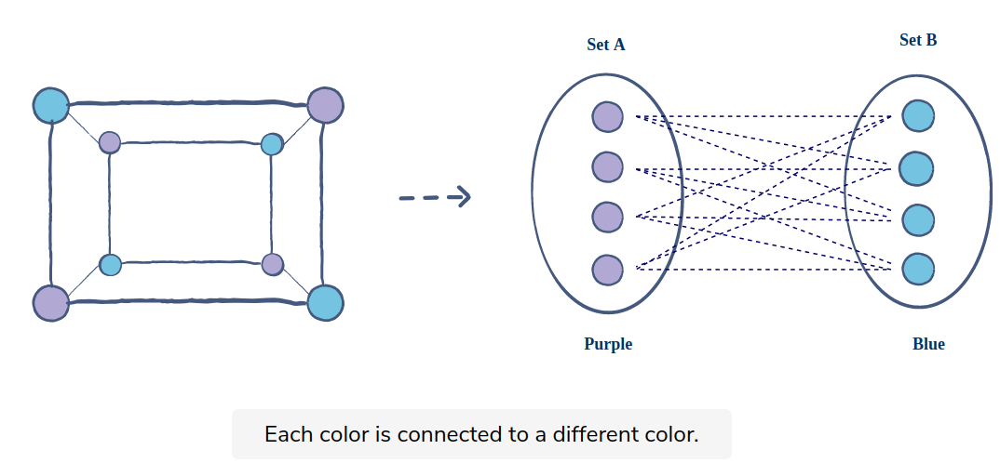

> Graph 
> 
> A Graph in the data structure can be termed as a data structure consisting of data that is stored among many groups of edges(paths) and vertices (nodes), which are interconnected. Graph data structure (N, E) is structured with a collection of Nodes and Edges. Both nodes and vertices need to be finite.

> Real life Application
>>1. Google Maps ( to find shortest time or distance)
>>2. Social Network ( user == vertex | connection == edge )
>>3. web search ( each page == vertex | link between 2 page == edge)

> [Types of Graphs](https://www.upgrad.com/blog/graphs-in-data-structure/#:~:text=A%20graph%20can%20be%20represented,the%20row%20and%20column%20labels.)

> How to prepair for Graph?
>1. Build a Graph
>2. Traverse the Graph using BFS / DFS
>3. Find if Graph is Cyclic or ACyclic using BFS / DFS
>4. Find the shortest path from source to destination
   1. BFS
   2. Dijkstra 
>5. Topological sorting
>6. Minimum spanning tree (MST)
>   1. Kruskal
>   2. Prim
>7. Backtracking
   1. nQueen
   2. Rat and Maze
   3. Knight Tour
>8. Techniques 
   1. Bellman ford
   2. Floyd warshall
   3. TSP
   4. Flood fill
   5. Graph Coloring 
   6. snake and ladder

> Different Types of Graph in Data Structure

| sr. No. | Graph Type                      | Definition                                                                                                                                                                                                                                                                                                                                                                                                                             | Example                                                                                                             |
|---------|---------------------------------|----------------------------------------------------------------------------------------------------------------------------------------------------------------------------------------------------------------------------------------------------------------------------------------------------------------------------------------------------------------------------------------------------------------------------------------|---------------------------------------------------------------------------------------------------------------------|
| 1       | Finite Graph                    | The graph G=(V, E) is called a finite graph if the number of vertices and edges in the graph is limited in number                                                                                                                                                                                                                                                                                                                      |                                                                                           |
| 2       | Infinite Graph                  | A graph G=(V, E) is said to infinite if the number of edges and vertices in the graph is infinite in number.                                                                                                                                                                                                                                                                                                                           |                                                                                       |
| 3       | Trivial Graph                   | A graph G= (V, E) is said to be trivial if there only exist single vertex in the graph without any edge.                                                                                                                                                                                                                                                                                                                               |                                                                                       |
| 4       | Simple Graph                    | A graph G=(V, E) is said to be a simple graph if there is one and only one edge between each pair of vertices. Thus there is only edge connecting 2 vertices and can be used to show one to one relationships between 2 elements.                                                                                                                                                                                                      |                                                                                       |
| 5       | Multi Graph                     |                                                                                                                                                                                                                                                                                                                                                                                                                                        |                                                                                                                     |
| 6       | Null Graph                      | It is a modified version of a trivial graph. A graph G= (V, E) is said to a null graph if there are n number of vertices exist, but no Edge exists that connects then.                                                                                                                                                                                                                                                                 |                                                                                       |
| 7       | Complete Graph                  | A graph G= (V, E) is said to be a complete graph in case it is also a simple graph. With this n number of vertices must be attached to each of other vertices using the edges. It is also known as a full graph, and the degree of each vertex must be n-1.                                                                                                                                                                            |                                                                                       |
| 8       | Pseudo Graph                    | A graph G= (V, E) is said to pseudo graph in case it contains a self-loop along with other edges.                                                                                                                                                                                                                                                                                                                                      |                                                                                       |
| 9       | Regular Graph                   | A graph G= (V, E) is said to be a regular graph if it is a simple graph with each vertex of the graph having the same degree. Thus every complete graph is a regular graph.                                                                                                                                                                                                                                                            |                                                                                       |
| 10      | Labelled Graph                  | A graph G= (V, E) is said to be a labelled or weighted graph because each of the edges in the graph holds some value or weight that denotes traversal cost through that edge.                                                                                                                                                                                                                                                          |                                                                                       |
| 11      | Digraph Graph                   | A graph is said to a digraph or directed graph in case the order of pair of vertices changes the meaning of the graph. i.e. in case, G=(V, E) is the graph and Vi, Vj is a par of vertices is different from Vj, Vi. This can be seen in road maps when one of the roads is unidirectional or one-way. To denote such kind of cases directed graph is used. For each edge e between (Vi, Vj), an arrow exists to denote its direction. |                                                                                       |
| 12      | Subgraph                        | A graph G1 =(Vx, Ex) is said to be a subgraph of G=(V, E) if Vx ⊆ V and Ex ⊆ E.                                                                                                                                                                                                                                                                                                                                                        |                                                     |
| 13      | Connected or Disconnected Graph | In case one can find a path from one vertex of the graph to any of the other vertex, then the graph is said to be a connected graph. Thus a null graph is said to a disconnected graph as there is no edge connecting the vertices.                                                                                                                                                                                                    | (A) – Connected Graph  (B) – Disconnected Graph  |
| 14      | Directed Acyclic Graph          | It’s also known as DAG, these are the graphs with directed edges, but they do not contain any cycle. Vertices also hold some data, and as it is directed; thus, edges are represented using an ordered pair of vertices.                                                                                                                                                                                                               |                                                                                     |
| 15      | Bipartite Graph                 | A bipartite graph also called a bi-graph, is a set of graph vertices, i.e, points where multiple lines meet, decomposed into two disjoint sets, meaning they have no element in common, such that no two graph vertices within the same set are adjacent.                                                                                                                                                                              |                                                                                                  |

> Graph Question Sets
> 
> 
| sr. no. | Question                                                                                                                                                                                                                                                                                                                                                                                                                                                                                                                                               | LeetCode Link                                                         | YouTube                                                                                                                                                |
|---------|--------------------------------------------------------------------------------------------------------------------------------------------------------------------------------------------------------------------------------------------------------------------------------------------------------------------------------------------------------------------------------------------------------------------------------------------------------------------------------------------------------------------------------------------------------|-----------------------------------------------------------------------|--------------------------------------------------------------------------------------------------------------------------------------------------------|
| 1       | DFS                                                                                                                                                                                                                                                                                                                                                                                                                                                                                                                                                    |                                                                       | [DFS](https://www.youtube.com/watch?v=CvUMf8c2JFo&list=PLEJXowNB4kPzByLnnFYNSCoqtFz0VKLk5&index=3)                                                     |
| 2       | BFS                                                                                                                                                                                                                                                                                                                                                                                                                                                                                                                                                    |                                                                       | [BFS](https://www.youtube.com/watch?v=YYq38LTz774&list=PLEJXowNB4kPzByLnnFYNSCoqtFz0VKLk5&index=4)                                                     |
| 3       | Detect cycle in a directed graph                                                                                                                                                                                                                                                                                                                                                                                                                                                                                                                       |                                                                       | [Detect cycle in a directed graph](https://www.youtube.com/watch?v=0dJmTuMrUZM&list=PLEJXowNB4kPzByLnnFYNSCoqtFz0VKLk5&index=5)                        |
| 4       | Detect cycle in an undirected graph                                                                                                                                                                                                                                                                                                                                                                                                                                                                                                                    |                                                                       | [Using Graph coloring method](https://www.youtube.com/watch?v=L0DcePeWHnM&list=PLEJXowNB4kPzByLnnFYNSCoqtFz0VKLk5&index=6)                             |
| 5       | #200 Number of islands                                                                                                                                                                                                                                                                                                                                                                                                                                                                                                                                 | [#200](https://leetcode.com/problems/number-of-islands/)              | [Using Graph coloring method](https://www.youtube.com/watch?v=__98uL6wst8&list=PLEJXowNB4kPzByLnnFYNSCoqtFz0VKLk5&index=7)                             |
| 6       | #886 We want to split a group of n people (labeled from 1 to n) into two groups of any size. Each person may dislike some other people, and they should not go into the same group. Given the integer n and the array dislikes where dislikes[i] = [ai, bi] indicates that the person labeled ai does not like the person labeled bi, return true if it is possible to split everyone into two groups in this way.  Example: Input: n = 4, dislikes = [[1,2],[1,3],[2,4]] <b>Output: true</b>  Explanation: group1 [1,4] and group2 [2,3]. | [#886](https://leetcode.com/problems/possible-bipartition/)           | [Possible Bipartition - Bipartite graph - Graph coloring](https://www.youtube.com/watch?v=0ACfAqs8mm0&list=PLEJXowNB4kPzByLnnFYNSCoqtFz0VKLk5&index=8) |
| 7       | #207 There are a total of numCourses courses you have to take, labeled from 0 to numCourses - 1. You are given an array prerequisites where prerequisites[i] = [ai, bi] indicates that you must take course bi first if you want to take course ai.   For example, the pair [0, 1], indicates that to take course 0 you have to first take course 1. Return true if you can finish all courses. Otherwise, return false.                                                                                                                         | [#207](https://leetcode.com/problems/course-schedule/)                | [Course Schedule, Deadlock detection, Graph coloring](https://www.youtube.com/watch?v=kXy0ABd1vwo&list=PLEJXowNB4kPzByLnnFYNSCoqtFz0VKLk5&index=9)    |
| 8       | #787 cheapest-flights-within-k-stops                                                                                                                                                                                                                                                                                                                                                                                                                                                                                                                   | [#787](https://leetcode.com/problems/cheapest-flights-within-k-stops) | [cheapest-flights-within-k-stops](https://www.youtube.com/watch?v=60RbWlDFsmI&list=PLEJXowNB4kPzByLnnFYNSCoqtFz0VKLk5&index=10)                                                                                                                                                   |

> Graph Example
1. Directed Graph 
2. UnDirected Graph 