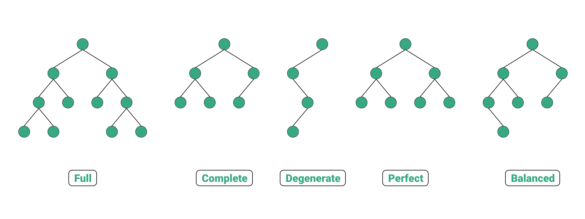
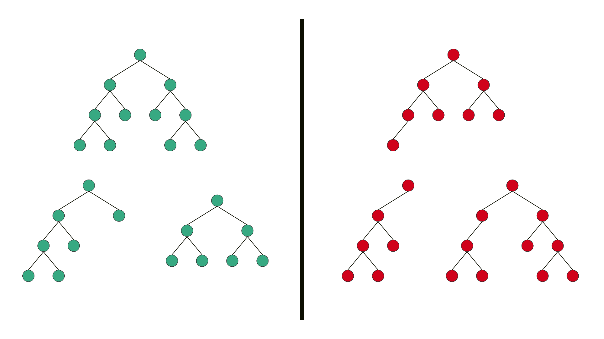
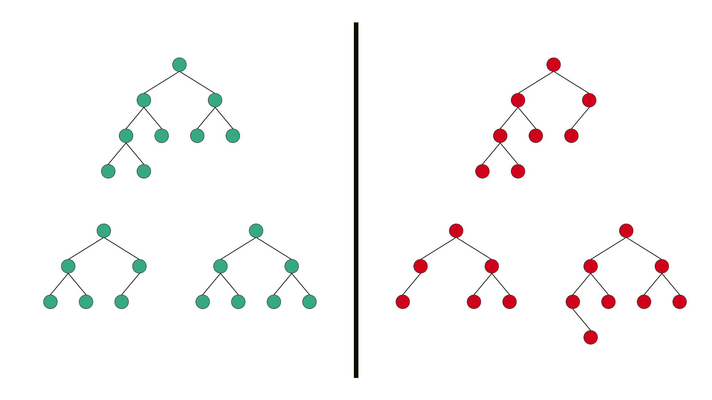
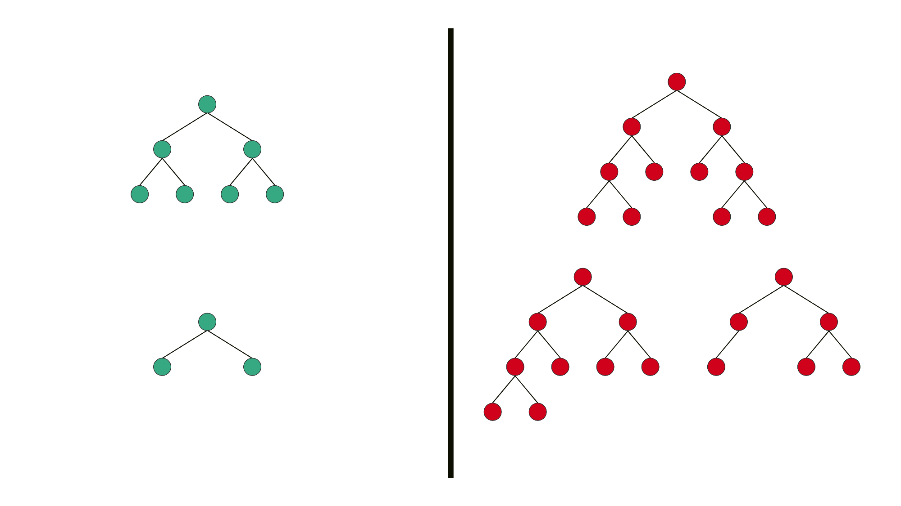
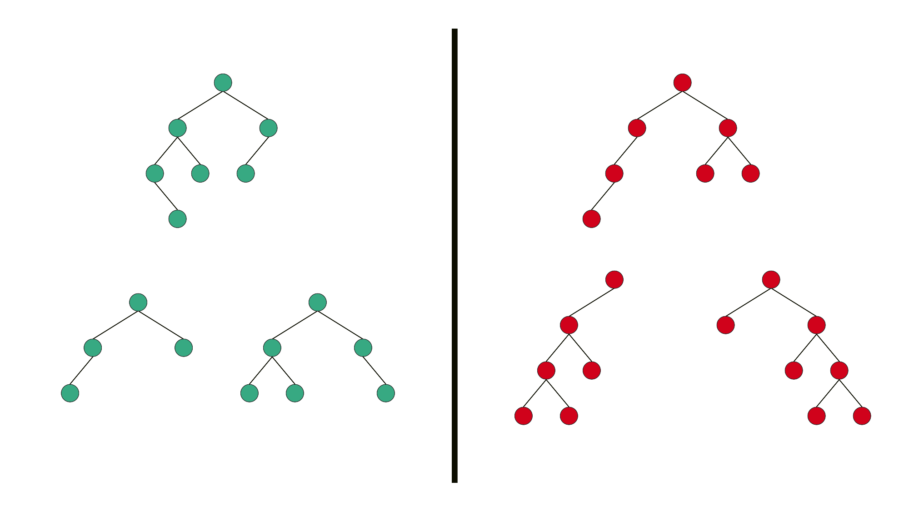
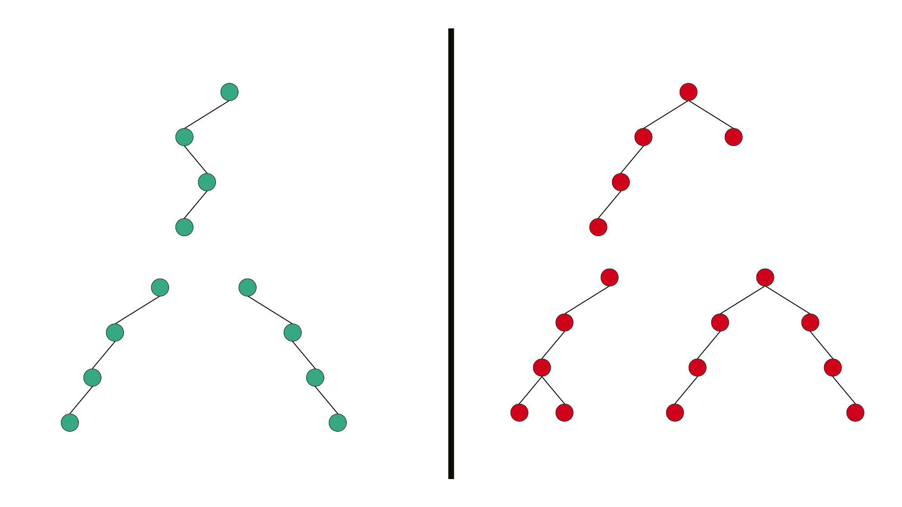

> Type of Binary Tree

| Binary Tree Type       | Definition                                                                                                                                                                                                                                                                                                                                             | Definition                |
|------------------------|--------------------------------------------------------------------------------------------------------------------------------------------------------------------------------------------------------------------------------------------------------------------------------------------------------------------------------------------------------|---------------------------|
| Full Binary Tree       | It is a special kind of a binary tree that has either zero children or two children. It means that all the nodes in that binary tree should either have two child nodes of its parent node or the parent node is itself the leaf node or the external node.                                                                                            |    |
| Complete Binary Tree   | A complete binary tree is another specific type of binary tree where all the tree levels are filled entirely with nodes, except the lowest level of the tree. Also, in the last or the lowest level of this binary tree, every node should possibly reside on the left side. Here is the structure of a complete binary tree:                          |    |
| Perfect Binary Tree    | A binary tree is said to be ‘perfect’ if all the internal nodes have strictly two children, and every external or leaf node is at the same level or same depth within a tree. A perfect binary tree having height ‘h’ has 2h – 1 node.                                                                                                                 |  |  
| Balanced Binary Tree   | A binary tree is said to be ‘balanced’ if the tree height is O(logN), where ‘N’ is the number of nodes. In a balanced binary tree, the height of the left and the right subtrees of each node should vary by at most one. An AVL Tree and a Red-Black Tree are some common examples of data structure that can generate a balanced binary search tree. |  | 
| Degenerate Binary Tree | A binary tree is said to be a degenerate binary tree or pathological binary tree if every internal node has only a single child. Such trees are similar to a linked list performance-wise.                                                                                                                                                             |  | 

